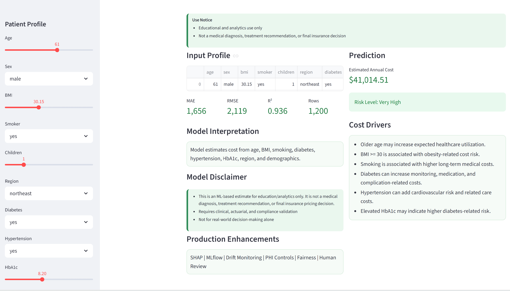
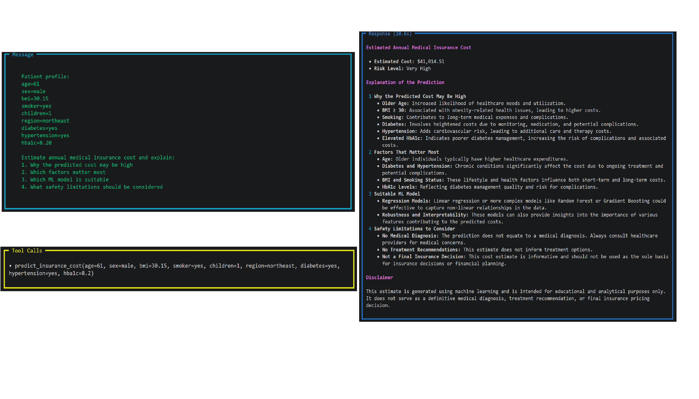

### Medical Insurance Diabetes Multi-Agent Project

Overview
--------
This project presents an end-to-end system for predicting medical insurance costs associated with diabetes-related risk factors.

The system integrates:
- A synthetic dataset with 1,200 records
- A Ridge Linear Regression training pipeline built from scratch
- A reusable prediction module for inference
- Basic model explainability using coefficient analysis
- A Streamlit-based interactive user interface
- A FastAPI service for API access
- A multi-agent framework (Agno) for structured reasoning and orchestration

Important
---------
This project is intended for educational and analytical purposes only.

It does NOT provide:
- Medical diagnosis
- Clinical treatment recommendations
- Official insurance pricing or underwriting decisions

## Demo

### Streamlit UI (Interactive Dashboard)

### Multi-Agent Output (Reasoning + Prediction)

Project Structure
-----------------
data/                  Dataset (CSV format)  
training/              Model training scripts  
models/                Saved trained models  
tools/                 Prediction and utility functions  
agents/                Agent orchestration logic  
streamlit_app.py       Streamlit application  
api.py                 FastAPI service  
app.py                 Multi-agent demo entry point  

Setup (Windows)
----------------
1. Create a virtual environment:

   python -m venv .venv

2. Activate the environment:

   .venv\Scripts\activate

3. Install dependencies:

   pip install -r requirements.txt

4. Configure environment variables:

   Copy `.env.example` to `.env`

   Then edit `.env` and add your API key:
   OPENAI_API_KEY=your_key_here

Train Model
-----------
Run the training pipeline:

   python training/train_model.py

Test Prediction Tool
--------------------
Run the test script:

   python tests/test_prediction_tool.py

Run Streamlit Application
-------------------------
Start the UI:

   streamlit run streamlit_app.py

Open in browser:

   http://localhost:8501

Run FastAPI Service
-------------------
Start the API server:

   uvicorn api:app --reload

Access API documentation:

   http://127.0.0.1:8000/docs

Run Multi-Agent Demo
--------------------
Execute:

   python app.py

Notes
-----
- Multi-agent functionality requires valid API keys in `.env`
- If you encounter API quota errors:
  - Enable OpenAI billing
  - Or switch to a lower-cost model such as `gpt-4o-mini`
