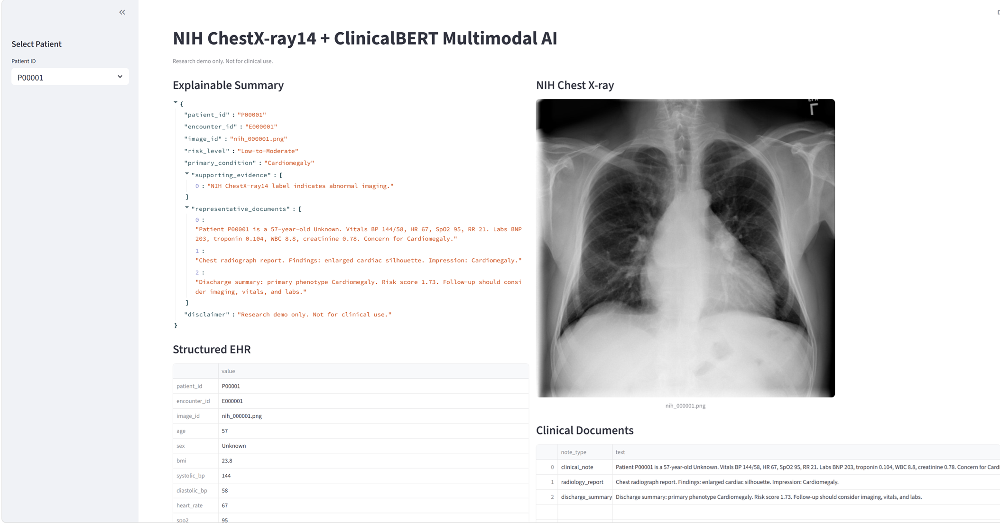

# NIH ChestX-ray14 + ClinicalBERT Multimodal Clinical GenAI Project

## Project Overview

This project is an end-to-end multimodal healthcare AI and Generative AI system integrating:

- NIH ChestX-ray14 medical imaging
- ClinicalBERT clinical NLP
- Structured EHR-style healthcare data
- Explainable AI
- Multimodal deep learning
- FastAPI deployment
- Streamlit dashboard

The system combines:

- chest X-ray images
- radiology reports
- clinical notes
- discharge summaries
- structured clinical variables

to generate explainable patient-level risk predictions and multimodal clinical reasoning.

---
## Output of Streamlit



---


# Key Objectives

## 1. Clinical NLP and Generative AI

- Use ClinicalBERT transformer models
- Process clinical notes and radiology reports
- Generate semantic text embeddings
- Support explainable clinical reasoning

---

## 2. Medical Imaging and Multimodal Learning

- Use NIH ChestX-ray14 chest X-rays
- Apply ResNet18 CNN image models
- Combine imaging + text + EHR features

---

## 3. Structured EHR Data Engineering

- Generate realistic EHR-style healthcare features
- Align labs, vitals, and imaging findings
- Create clinically consistent multimodal data

---

## 4. Multimodal Fusion Architecture

The multimodal fusion model combines:

### Image Features
- ResNet18 image embeddings

### Text Features
- ClinicalBERT embeddings

### Structured Features
- EHR variables

for:
- patient risk prediction
- multimodal reasoning
- explainable AI outputs

---

## 5. Explainable AI

The project generates:

- supporting evidence
- explainable JSON outputs
- interpretable patient summaries
- representative clinical notes
- multimodal risk reasoning

---

## 6. Deployment and End-to-End Pipelines

- FastAPI REST APIs
- Streamlit dashboard
- CUDA GPU acceleration

---

# Dataset

## NIH ChestX-ray14

This project uses approximately:

- ~1,000 NIH chest X-ray images (Only a limited number of images are uploaded for GitHub)
- ~1,000 structured EHR rows
- ~3,000 clinical documents

For GitHub submission, only a limited subset of images is used.

Official NIH dataset:

https://nihcc.app.box.com/v/ChestXray-NIHCC

---

# How NIH Labels Become Structured EHR + Clinical Notes

The project starts with the NIH metadata file:

```text
NIH Data_Entry_2017.csv
        ↓
01_prepare_nih_subset.py
        ↓
data/processed/image_labels.csv
        ↓
02_generate_ehr_and_notes.py
        ↓
structured EHR + clinical notes
```

Explanation:

- `Data_Entry_2017.csv` contains NIH chest X-ray labels
- `01_prepare_nih_subset.py` prepares a clean image subset
- `image_labels.csv` stores processed image labels
- `02_generate_ehr_and_notes.py` generates synthetic EHR data and clinical notes

---

# Installation

Install Python dependencies:

```bash
pip install -r requirements.txt
```

---

# Optional GPU PyTorch Installation

For CUDA GPU acceleration:

```bash
pip uninstall torch torchvision torchaudio -y

pip install torch torchvision torchaudio \
--index-url https://download.pytorch.org/whl/cu124
```

---

# Run Full Pipeline

Run all project steps:

```bash
python src/00_run_all.py
```

---

# Launch Applications

## FastAPI

```bash
uvicorn src.api.main:app --reload
```

API documentation:

```text
http://127.0.0.1:8000/docs
```

---

## Streamlit Dashboard

```bash
streamlit run src/app/streamlit_app.py
```

Dashboard features:

- patient selection
- chest X-ray viewer
- EHR viewer
- clinical document viewer
- explainable summaries
- risk distribution charts

---

# Model Performance

| Metric | Score |
|---|---|
| Accuracy | 95.5% |
| F1-score | 0.927 |
| ROC-AUC | 0.994 |
| PR-AUC | 0.987 |

---


# Disclaimer

This project is intended for practice purpose such as:

- education
- research
- portfolio demonstration

only.

This project is NOT intended for:

- medical diagnosis
- clinical treatment
- production healthcare deployment
- real-world medical decision-making
